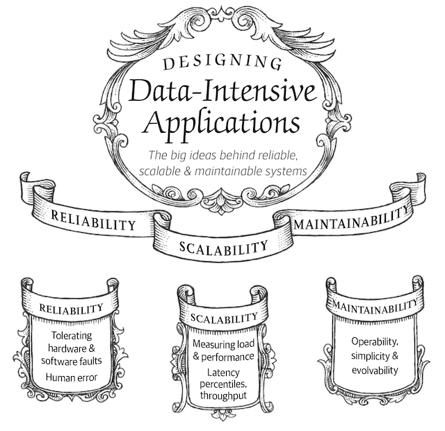

link:: 
tags:: 
relations:: [Designing Data-Intensive Applications](Designing%20Data-Intensive%20Applications.md)

[<- BACK TO BOOK ](Designing%20Data-Intensive%20Applications.md)

# Chapter 1. Reliability, scalability, and maintainability

Many applications today are ***data-intensive***, as opposed to ***compute-intensive***.

Challenges faced - 

- the amount of data, 
- the complexity of data, and 
- the speed at which it is changing.

Standared Building blocks(**data systems**) for data intensive applications :

- Store data so that they, or another application, can find it again later (***databases***)
- Remember the result of an expensive operation, to speed up reads (***caches***)
- Allow users to search data by keyword or filter it in various ways (***search indexes***)
- Send a message to another process, to be handled asynchronously (***stream processing***)
- Periodically crunch a large amount of accumulated data (***batch processing***)

There are many data systems with *different characteristics*, because different applications have different requirements. There are various approaches to caching, several ways of building search indexes, and so on. 

When building an application, we still need to figure out which tools and which approaches are the most appropriate for the task at hand. And it can be hard to combine tools when you need to do something that a single tool cannot do alone.

## Thinking About Data Systems

> Data Systems are tools for data storage and processing.
> Data systems are such a successful abstraction.

All data systems have superficial similarity - *store data for some time*.
and could have very different characteristics - 
-  have very different access patterns
-  different performance characteristics,
-  different implementations

Many new tools have emerged and have been optimized for a variety of different use cases.
And traditional categories are no longer valid.
For example, there are datastores that are also used as message queues (Redis), and there are message queues with database-like durability guarantees (Apache Kafka). The boundaries between the categories are becoming blurred.

> Increasingly many applications now have such demanding or wide-ranging requirements that a single tool can no longer meet all of its data processing and storage needs. 
> Instead, the work is broken down into tasks that can be performed efficiently on a single tool, and those different tools are stitched together using application code.

*One possible architecture for a data system that combines several components.*

Common questions when designing data systems or service

- How do you ensure that the data remains correct and complete, even when things go wrong internally? 
- How do you provide consistently good performance to clients, even when parts of your system are degraded? 
- How do you scale to handle an increase in load? 
- What does a good API for the service look like?

Three concerns that are important in most software systems:

### 1.[Reliability](DDIA-%20Chapter%201.1%20Reliability.md)

The system should continue to work *correctly* (performing the correct function at the desired level of performance) even in the face of *adversity* (hardware or software faults, and even human error). 

### 2. [Scalability](DDIA-%20Chapter%201.2%20Scalability.md)

As the system *grows* (in data volume, traffic volume, or complexity), there should be reasonable ways of dealing with that growth. 

### 3. [Maintainability](DDIA-%20Chapter%201.3%20Maintainability.md)

Over time, many different people will work on the system (engineering and operations, both maintaining current behavior and adapting the system to new use cases), and they should all be able to work on it *productively*.
