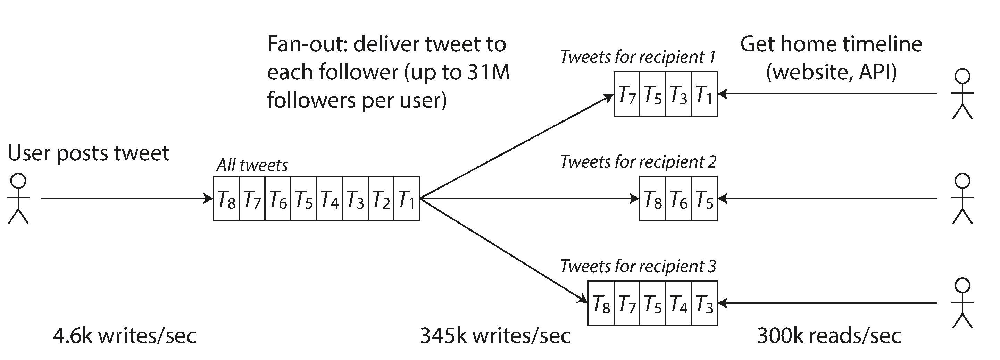
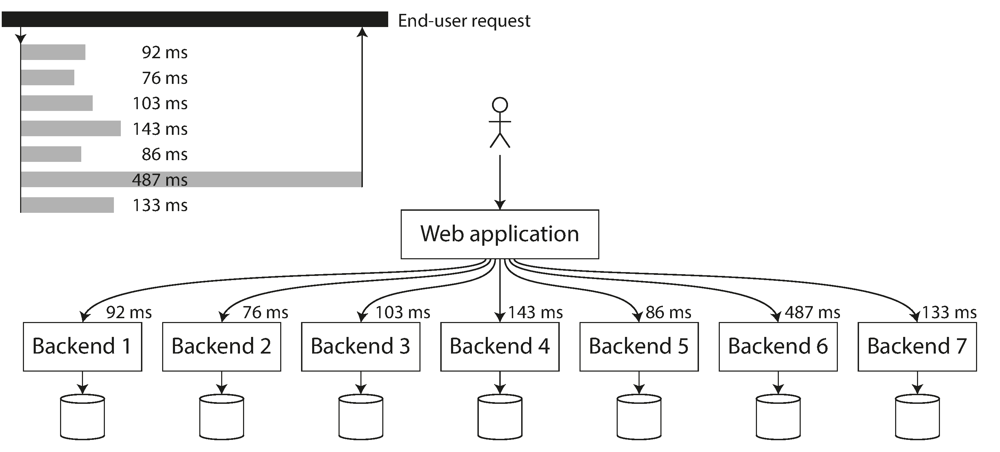

link:: 
tags:: 
relations:: [Designing Data-Intensive Applications](Designing%20Data-Intensive%20Applications.md)

[<- BACK TO BOOK ](Designing%20Data-Intensive%20Applications.md)
[<- Back to Chapter 1](DDIA-%20Chapter%201.%20Reliability,%20scalability,%20and%20maintainability.md)

# Chapter 1.2 Scalability

> *Scalability* is the term we use to describe a system’s ability to cope with increased load.

One common reason for degradation of system reliability in future is **increased load:** perhaps the system has grown from 10,000 concurrent users to 100,000 concurrent users, or from 1 million to 10 million.

## Describing Load

First, we need to succinctly describe the current load on the system; only then can we discuss growth questions (what happens if our load doubles?).

> Load can be described with a few numbers which we call *load parameters*. 

- The best choice of parameters depends on the architecture of your system: it may be requests per second to a web server, the ratio of reads to writes in a database, the number of simultaneously active users in a chat room, the hit rate on a cache, or something else.
- Perhaps the average case is what matters for you, or perhaps your bottleneck is dominated by a small number of extreme cases.

### Twitter example 

Two of Twitter’s main operations are:

- Post tweet

    A user can publish a new message to their followers (4.6k requests/sec on average, over 12k requests/sec at peak).

- Home timeline

    A user can view tweets posted by the people they follow (300k requests/sec).

Simply handling 12,000 writes per second (the peak rate for posting tweets) would be fairly easy.
Twitter’s scaling challenge is not primarily due to tweet volume, but due to *fan-out*—each user follows many people, and each user is followed by many people. 

There are broadly two ways of implementing these two operations:

1. Posting a tweet simply inserts the new tweet into a global collection of tweets. When a user requests their home timeline, look up all the people they follow, find all the tweets for each of those users, and merge them (sorted by time).
    
2. Maintain a cache for each user’s home timeline—like a mailbox of tweets for each recipient user. When a user *posts a tweet*, look up all the people who follow that user, and insert the new tweet into each of their home timeline caches. The request to read the home timeline is then cheap, because its result has been computed ahead of time.
    

The first version of Twitter used approach 1, but the systems struggled to keep up with the load of home timeline queries, so the company switched to approach 2. This works better because the average rate of published tweets is almost two orders of magnitude lower than the rate of home timeline reads, and so in this case it’s preferable to do more work at write time and less at read time.

However, the downside of approach 2 is that posting a tweet now requires a lot of extra work. On average, a tweet is delivered to about 75 followers, so 4.6k tweets per second become 345k writes per second to the home timeline caches. But this average hides the fact that the number of followers per user varies wildly, and some users have over 30 million followers. This means that a single tweet may result in over 30 million writes to home timelines! Doing this in a timely manner—Twitter tries to deliver tweets to followers within five seconds—is a significant challenge.

The final twist of the Twitter anecdote: now that approach 2 is robustly implemented, Twitter is moving to a hybrid of both approaches. Most users’ tweets continue to be fanned out to home timelines at the time when they are posted, but a small number of users with a very large number of followers (i.e., celebrities) are excepted from this fan-out. Tweets from any celebrities that a user may follow are fetched separately and merged with that user’s home timeline when it is read, like in approach 1. This hybrid approach is able to deliver consistently good performance.

## Describing Performance

Two ways : 

- When you increase a load parameter and keep the system resources (CPU, memory, network bandwidth, etc.) unchanged, how is the performance of your system affected?
- When you increase a load parameter, how much do you need to increase the resources if you want to keep performance unchanged?

In a batch processing system such as Hadoop, we usually care about *throughput*—the number of records we can process per second, or the total time it takes to run a job on a dataset of a certain size.In online systems, what’s usually more important is the service’s *response time*—that is, the time between a client sending a request and receiving a response.

### LATENCY AND RESPONSE TIME

> *Latency* and *response time* are often used synonymously, but they are not the same. The response time is what the client sees: besides the actual time to process the request (the *service time*), it includes network delays and queueing delays. Latency is the duration that a request is waiting to be handled—during which it is *latent*, awaiting service

In practice, in a system handling a variety of requests, the response time can vary a lot. We therefore need to think of response time not as a single number, but as a *distribution* of values that you can measure.

*Illustrating mean and percentiles: response times for a sample of 100 requests to a service:*

It’s common to see the *average* response time of a service reported(*arithmetic mean*).

However, the mean is not a very good metric if you want to know your “typical” response time, because it doesn’t tell you how many users actually experienced that delay.

Usually it is better to use *percentiles*. If you take your list of response times and sort it from fastest to slowest, then the *median* is the halfway point: for example, if your median response time is 200 ms, that means half your requests return in less than 200 ms, and half your requests take longer than that.

This makes the median a good metric if you want to know how long users typically have to wait: half of user requests are served in less than the median response time.

The median is also known as the *50th percentile*, and sometimes abbreviated as *p50*.

In order to figure out how bad your outliers are, you can look at higher percentiles: the *95th*, *99th*, and *99.9th* percentiles are common (abbreviated *p95*, *p99*, and *p999*).

High percentiles of response times, also known as *tail latencies*.

> For example, Amazon describes response time requirements for internal services in terms of the 99.9th percentile, even though it only affects 1 in 1,000 requests. This is because the customers with the slowest requests are often those who have the most data on their accounts because they have made many purchases—that is, they’re the most valuable customers.

On the other hand, optimizing the 99.99th percentile (the slowest 1 in 10,000 requests) was deemed too expensive and to not yield enough benefit for Amazon’s purposes. Reducing response times at very high percentiles is difficult because they are easily affected by random events outside of your control, and the benefits are diminishing.

For example, percentiles are often used in *service level objectives* (SLOs) and *service level agreements* (SLAs), contracts that define the expected performance and availability of a service. An SLA may state that the service is considered to be up if it has a median response time of less than 200 ms and a 99th percentile under 1 s (if the response time is longer, it might as well be down), and the service may be required to be up at least 99.9% of the time. These metrics set expectations for clients of the service and allow customers to demand a refund if the SLA is not met.

*head-of-line blocking*:it only takes a small number of slow requests to hold up the processing of subsequent requests.

*tail latency amplification*: Even if only a small percentage of backend calls are slow, the chance of getting a slow call increases if an end-user request requires multiple backend calls, and so a higher proportion of end-user requests end up being slow.

#### Monitoring Dashboards

- you need to efficiently calculate them on an ongoing basis.
- there are algorithms that can calculate a good approximation of percentiles at minimal CPU and memory cost
    - forward decay
    - t-digest
    - HdrHistogram
- Beware that averaging percentiles, e.g., to reduce the time resolution or to combine data from several machines, is mathematically meaningless—the right way of aggregating response time data is to add the histograms

## Approaches for Coping with Load

> If you are working on a fast-growing service, it is therefore likely that you will need to rethink your architecture on every order of magnitude load increase—or perhaps even more often than that.

1. *scaling up* (*vertical scaling*, moving to a more powerful machine) and 
2. *scaling out* (*horizontal scaling*, distributing the load across multiple smaller machines).

Distributing load across multiple machines is also known as a *shared-nothing* architecture. 

*Elastic systems*  can automatically add computing resources when they detect a load increase. An elastic system can be useful if load is highly unpredictable but not simple to setup.

While distributing stateless services across multiple machines is fairly straightforward, taking stateful data systems from a single node to a distributed setup can introduce a lot of additional complexity.

The architecture of systems that operate at large scale is usually highly specific to the application—there is no such thing as a generic, one-size-fits-all scalable architecture (informally known as *magic scaling sauce*).

An architecture that scales well for a particular application is built around assumptions of which operations will be common and which will be rare—the load parameters.