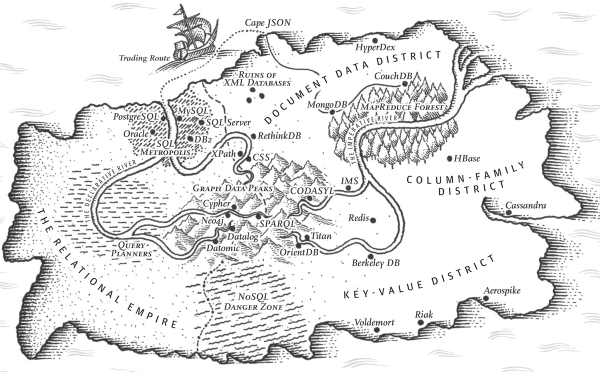

link:: 
tags:: 
relations:: [Designing Data-Intensive Applications](Designing%20Data-Intensive%20Applications.md)

[<- BACK TO BOOK ](Designing%20Data-Intensive%20Applications.md)

# Chapter 2. Data Models and Query Languages



> Data models effect not only on how the software is written, but also on how we _think about the problem_ that we are solving.

Most applications are built by layering one data model on top of another. For each layer, the key question is: how is it _represented_ in terms of the next-lower layer? For example:

1.  As an application developer, you look at the real world (in which there are people, organizations, goods, actions, money flows, sensors, etc.) and model it in terms of objects or data structures, and APIs that manipulate those data structures. Those structures are often specific to your application.
2.  When you want to store those data structures, you express them in terms of a general-purpose data model, such as JSON or XML documents, tables in a relational database, or a graph model.
3.  The engineers who built your database software decided on a way of representing that JSON/XML/relational/graph data in terms of bytes in memory, on disk, or on a network. The representation may allow the data to be queried, searched, manipulated, and processed in various ways.
4.  On yet lower levels, hardware engineers have figured out how to represent bytes in terms of electrical currents, pulses of light, magnetic fields, and more.

There are many different kinds of data models, and every data model embodies assumptions about how it is going to be used. Some kinds of usage are easy and some are not supported; some operations are fast and some perform badly; some data transformations feel natural and some are awkward.

## Relational Model Versus Document Model

**Relational Model: data is organized into _relations_ (called _tables_ in SQL), where each relation is an unordered collection of _tuples_ (_rows_ in SQL).**
proposed by Edgar Codd in 1970.

Relational database management systems (RDBMSes) and SQL became populer in around mid 1980 mostly for  _business data processing_ , *transaction processing* , *batch processing*

Other databases at that time forced application developers to think a lot about the internal representation of the data in the database.(i.e. how to query data one by one, how to optimize the query)
The _network model_ and the _hierarchical model_ were the main alternatives to relational model in early days

## The Birth of NoSQL

The name “NoSQL” is unfortunate, since it doesn’t actually refer to any particular technology.

Several driving forces behind the adoption of NoSQL databases, including:
-   greater scalability than relational databases, including very large datasets or very high write throughput
-   A widespread preference for free and open source software over commercial database products
-   Specialized query operations that are not well supported by the relational model
-   Frustration with the restrictiveness of relational schemas, and a desire for a more dynamic and expressive data model.


```
NoSQL is an accidental neologism. There is no prescriptive definition—all you can make is an observation of common characteristics.
The common characteristics of NoSQL databases are
    -   Not using the relational model (nor the SQL language)
    -   Running well on clusters
    -   Open-source
    -   Built for the 21st century web estates
    -   Schemaless
The most important result of the rise of NoSQL is Polyglot Persistence.
```

> Polyglot Persistence : all apps can have different technology requirements. So different models will coexist.

## [2.1 The Object-Relational Mismatch](DDIA-%20Chapter%202.1%20The%20Object-Relational%20Mismatch.md)

## [2.2 Many-to-One and Many-to-Many Relationships](DDIA-%20Chapter%202.2%20Many-to-One%20and%20Many-to-Many%20Relationships.md)

## [2.3 Are Document Databases Repeating History?](DDIA-%20Chapter%202.3%20Are%20Document%20Databases%20Repeating%20History.md)

## [2.4 Relational Versus Document Databases Today](DDIA-%20Chapter%202.4%20Relational%20Versus%20Document%20Databases%20Today.md)

## [2.5 Query Languages for Data](DDIA-%20Chapter%202.5%20Query%20Languages%20for%20Data.md)

## [2.6 Graph-Like Data Models](DDIA-%20Chapter%202.6%20Graph-Like%20Data%20Models.md)

## Refs

- [Summary of 35 years of data model proposals](Refs/What%20Goes%20Around%20Comes%20Around.md)

## Resources to watch/read
- [Introduction to NoSQL • Martin Fowler • GOTO 2012](https://www.youtube.com/watch?v=qI_g07C_Q5I)
- [NoSQL distilled book- keynotes](https://www.martinfowler.com/articles/nosqlKeyPoints.html)
