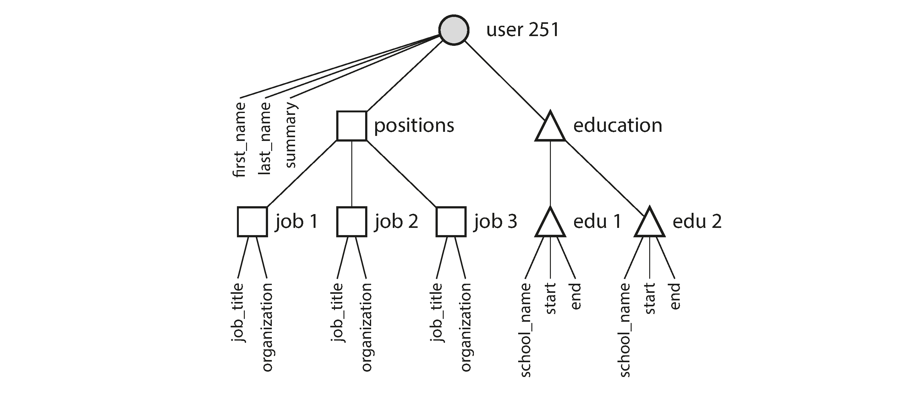

link:: 
tags:: 
relations:: [Designing Data-Intensive Applications](Designing%20Data-Intensive%20Applications.md)

[<- BACK TO BOOK ](Designing%20Data-Intensive%20Applications.md)
[<- Back to Chapter 2](DDIA-%20Chapter%202.%20Data%20Models%20and%20Query%20Languages.md)

# Chapter 2.1 The Object-Relational Mismatch

This topic has been picked up in past by many researchers.see [OO Era](Refs/What%20Goes%20Around%20Comes%20Around.md#OO%20Era).

Most application development today is done in object-oriented programming languages, which leads to a common criticism of the SQL data model: if data is stored in relational tables, an awkward translation layer is required between the objects in the application code and the database model of tables, rows, and columns. 
The disconnect between the models is sometimes called an ==_impedance mismatch_==

Object-relational mapping (ORM) frameworks like ActiveRecord and Hibernate reduce the amount of boilerplate code required for this translation layer, but they can’t completely hide the differences between the two models.

### Example: Resume/ Linkedin Profile

There is a one-to-many relationship from the user to other items which can be multi-valued.
In Relational model - 
1. put items in their table and link to user table.
2. multi-valued data to be stored within a single row,with support for querying and indexing inside those documents
3. encode jobs, education, and contact info as a JSON or XML document, store it on a text column in the database, and let the application interpret its structure and content.Cannot query database for values inside that encoded column.

For a data structure like a résumé, which is mostly a self-contained _document_, a JSON representation can be quite appropriate. 
JSON has the appeal of being much simpler than XML. Document-oriented databases like MongoDB, RethinkDB, CouchDB, and Espresso support this data model.
The JSON representation has better _locality_ than the multi-table schema.

If you want to fetch a profile in the relational example, you need to either perform multiple queries (query each table by `user_id`) or perform a messy multi-way join between the `users` table and its subordinate tables. 
In the JSON representation, all the relevant information is in one place, and one query is sufficient.

Example : Resume : One-to-many relationships forming a tree structure.