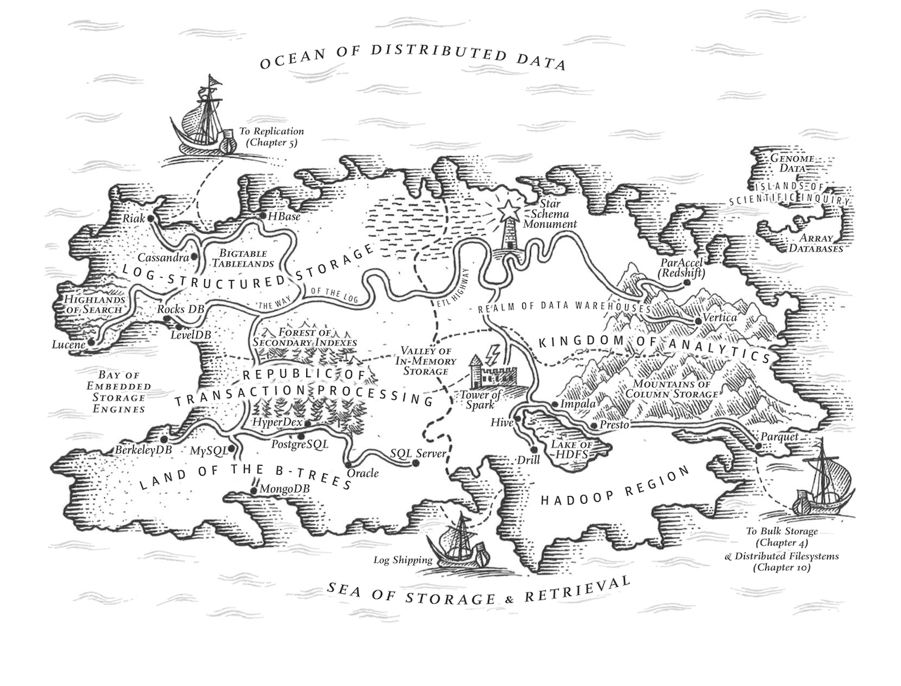

link:: 
tags:: 
relations:: [Designing Data-Intensive Applications](Designing%20Data-Intensive%20Applications.md)

[<- BACK TO BOOK ](Designing%20Data-Intensive%20Applicatio

# Chapter 3. Storage and Retrieval

On the most fundamental level, a database needs to do two things: 
- when you give it some data, it should store the data, and 
- when you ask it again later, it should give the data back to you.

We’re probably not going to implement your own storage engine from scratch, but you do need to select a storage engine that is appropriate for your application, from the many that are available.

We will examine two families of storage engines:
1. _log-structured_ storage engines, and 
2. _page-oriented_ storage engines such as B-trees.

## [Chapter 3.1 World’s simplest database](DDIA-%20Chapter%203.1%20World’s%20simplest%20database.md)

## [Chapter 3.2 Hash Indexes](DDIA-%20Chapter%203.2%20Hash%20Indexes.md)

## [Chapter 3.3 SSTables and LSM-Trees](DDIA-%20Chapter%203.3%20SSTables%20and%20LSM-Trees.md)

## [Chapter 3.4 B-Trees](DDIA-%20Chapter%203.4%20B-Trees.md)

## [Chapter 3.5 Comparing B-Trees and LSM-Trees](DDIA-%20Chapter%203.5%20Comparing%20B-Trees%20and%20LSM-Trees.md)

## [Chapter 3.6 Other Indexing Structures](DDIA-%20Chapter%203.6%20Other%20Indexing%20Structures.md)

## [DDIA- Chapter 3.7 Transaction Processing or Analytics?](DDIA-%20Chapter%203.7%20Transaction%20Processing%20or%20Analytics?.md)

## Refs
 - [PAPER - Bigtable: A Distributed Storage System for Structured Data](Refs/Bigtable-%20A%20Distributed%20Storage%20System%20for%20Structured%20Data.pdf)
 - 