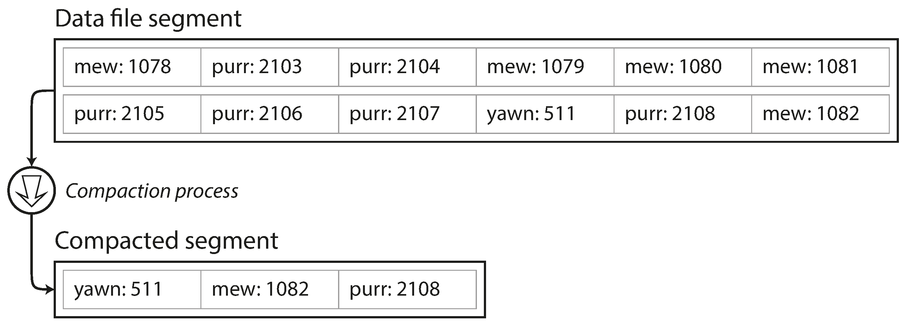
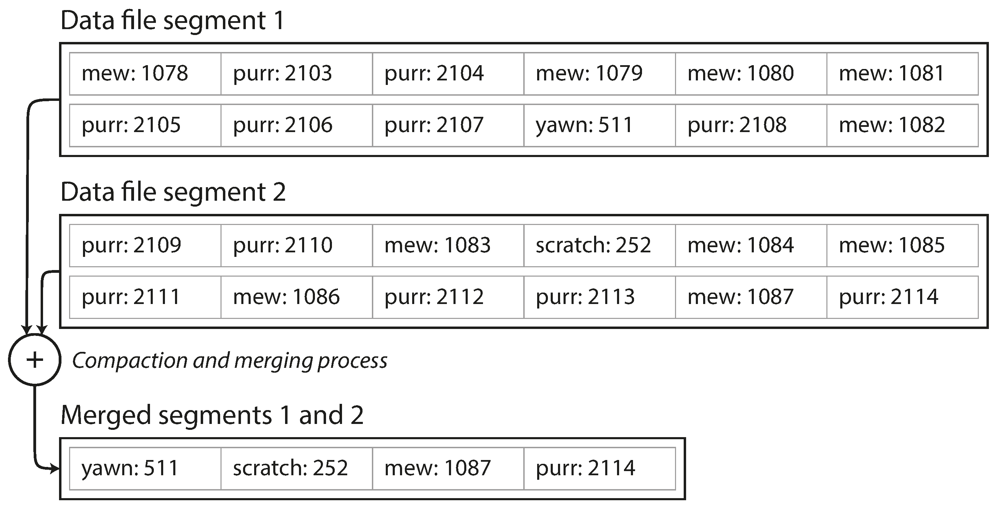

link:: 
tags:: 
relations:: [Designing Data-Intensive Applications](Designing%20Data-Intensive%20Applications.md)

[<- BACK TO BOOK ](Designing%20Data-Intensive%20Applications.md)
[<- Back to Chapter 3](DDIA-%20Chapter%203.%20Storage%20and%20Retrieval.md)

# Chapter 3.2 Hash Indexes

## Key-value stores

Since we already have hash maps for our in-memory data structures, why not use them to index our data on disk?

Let’s say our data storage consists only of appending to a file, as in the preceding example. 
Then the simplest possible indexing strategy is this: keep an in-memory hash map where every key is mapped to a byte offset in the data file—the location at which the value can be found.

### Example : Bitcask

Bitcask offers high-performance reads and writes, subject to the requirement that all the keys fit in the available RAM, since the hash map is kept completely in memory. 
The values can use more space than there is available memory, since they can be loaded from disk with just one disk seek. 
If that part of the data file is already in the filesystem cache, a read doesn’t require any disk I/O at all.
A storage engine like Bitcask is well suited to situations where the value for each key is updated frequently.

### Managing log-file/disk space

- A good solution is to break the log into segments of a certain size by closing a segment file when it reaches a certain size, and making subsequent writes to a new segment file. 
- perform compaction on closed segments, 
- **Compaction means throwing away duplicate keys in the log, and keeping only the most recent update for each key.**

- As compaction makes segments much smaller(removal of duplicate keys), we can merge several segments while doing compaction.
- Segments are never modified after they have been written, so the merged segment is written to a new file.
- Compaction can be done in background thread and Reads can be served by old segments.

## Reads
- each segments will have their own hash map. which will help in compaction.
- For reads, first most recent segment is checked then older in sequence.
- compaction keeps this segment list small. 

## Practical issues

Lots of detail goes into making this simple idea work in practice. Briefly, some of the issues that are important in a real implementation are:

1. File format
CSV is not the best format for a log. It’s faster and simpler to use a binary format that first encodes the length of a string in bytes, followed by the raw string (without need for escaping).

2. Deleting records
If you want to delete a key and its associated value, you have to append a special deletion record to the data file (sometimes called a _tombstone_). When log segments are merged, the tombstone tells the merging process to discard any previous values for the deleted key.

3. Crash recovery
If the database is restarted, the in-memory hash maps are lost. In principle, you can restore each segment’s hash map by reading the entire segment file from beginning to end and noting the offset of the most recent value for every key as you go along. However, that might take a long time if the segment files are large, which would make server restarts painful. Bitcask speeds up recovery by storing a snapshot of each segment’s hash map on disk, which can be loaded into memory more quickly.

4. Partially written records
The database may crash at any time, including halfway through appending a record to the log. Bitcask files include checksums, allowing such corrupted parts of the log to be detected and ignored.

5. Concurrency control
As writes are appended to the log in a strictly sequential order, a common implementation choice is to have only one writer thread. Data file segments are append-only and otherwise immutable, so they can be read concurrently by multiple threads.

## append only benefits

 an append-only design turns out to be good for several reasons:

- Appending and segment merging are sequential write operations, which are generally much faster than random writes, especially on magnetic spinning-disk hard drives. To some extent sequential writes are also preferable on flash-based _solid state drives_ (SSDs). 
- Concurrency and crash recovery are much simpler if segment files are append-only or immutable. For example, you don’t have to worry about the case where a crash happened while a value was being overwritten, leaving you with a file containing part of the old and part of the new value spliced together.
- Merging old segments avoids the problem of data files getting fragmented over time.

## limitations of hash table index

- The hash table must fit in memory(at least to perform well).
- Range queries are not efficient. For example, you cannot easily scan over all keys between `kitty00000` and `kitty99999`—you’d have to look up each key individually in the hash maps.

