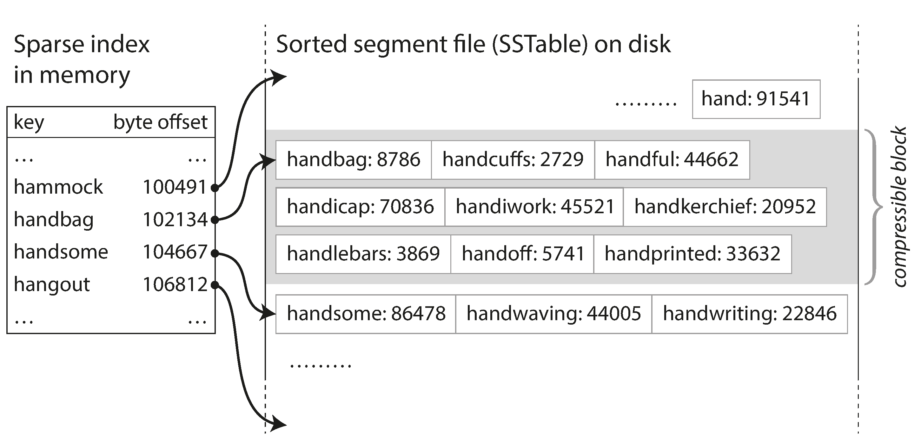

link:: 
tags:: 
relations:: [Designing Data-Intensive Applications](Designing%20Data-Intensive%20Applications.md)

[<- BACK TO BOOK ](Designing%20Data-Intensive%20Applications.md)
[<- Back to Chapter 3](DDIA-%20Chapter%203.%20Storage%20and%20Retrieval.md)

# Chapter 3.3 SSTables and LSM-Trees

 - Each log-structured storage segment is a sequence of key-value pairs.
 - Order of key-value pairs does not matter other then values later in log takes precedence if key copy occurs
 - When on disk segment files are stored with sorted by key they are called  **_Sorted String Table_, or _SSTable_** 

 SSTables advantages over log segments with hash indexes:
1. Merging segments is simple and efficient, even if the files are bigger than the available memory. Like  _mergesort_ algorithm : start by reading lowest key and write to output file. Output will also be sorted. In case of conflict discard values from older segment.
2. For SSTables, index of all the keys in memory is not required. A sparse index would work well. 

3.  Since read requests need to scan over several key-value pairs in the requested range anyway, it is possible to group those records into a block and compress it before writing it to disk. Besides saving disk space, compression also reduces the I/O bandwidth use.

## Constructing and maintaining SSTables

- Maintaining a sorted structure in memory is much easier. 
- Well-known tree data structures to keep keys sorted - B-Trees , red-back trees, AVL trees

### storage engine workflow
- Writes added to an in-memory balanced tree data structure. This in-memory tree is sometimes called a _memtable_.
- When the memtable gets bigger than some threshold (typically a few megabytes) write it out to disk as an SSTable file. The new SSTable file becomes the most recent segment of the database. 
- While the SSTable is being written out to disk, writes can continue to a new memtable instance.
- For read request, first try to find the key in the memtable, then in the most recent on-disk segment, then in the next-older segment, etc.
- From time to time, run a merging and compaction process in the background to combine segment files and to discard overwritten or deleted values.
- For Crash handling, keep a separate log on disk to which every write is immediately appended. After successful written to disk corresponding segment can be discarded

 ## Making an LSM-tree out of SSTables

Originally this indexing structure was described by Patrick O’Neil et al. under the name **_Log-Structured Merge-Tree_ (or LSM-Tree)** , building on earlier work on log-structured filesystems . 
Storage engines that are based on **this principle of merging and compacting sorted files are often called LSM storage engines**.

A **full-text index** is much more complex than a key-value index but is based on a similar idea: 
given a word in a search query, find all the documents (web pages, product descriptions, etc.) that mention the word. This is implemented with a key-value structure where the key is a word (a _term_) and the value is the list of IDs of all the documents that contain the word (the _postings list_).

Sometimes this index is called **term dictionary**

## Performance optimizations

-  **nonexistent keys** -  nonexistent keys might require multiple disk seeks i.e. for checking in every segment.  In order to optimize this kind of access, storage engines often use additional **Bloom filters** . 
> A Bloom filter is a memory-efficient data structure for approximating the contents of a set. It can tell you if a key does not appear in the database, and thus saves many unnecessary disk reads for nonexistent keys.

 - **Strategies to merge and compaction of SSTables :**  Strategies determine determine the order and timing of merging and compaction.

 1. _size-tiered_ compaction :  In this, newer and smaller SSTables are successively merged into older and larger SSTables
 2. _leveled_ compaction : In this, the key range is split up into smaller SSTables and older data is moved into separate “levels,” which allows the compaction to proceed more incrementally and use less disk space.

LevelDB and RocksDB use leveled compaction (hence the name of LevelDB), HBase uses size-tiered, and Cassandra supports both 

