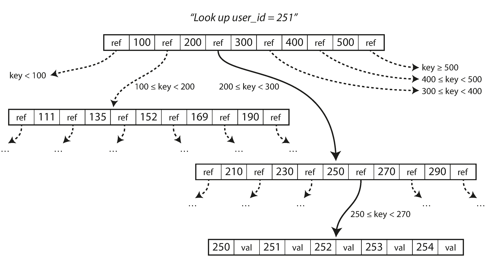
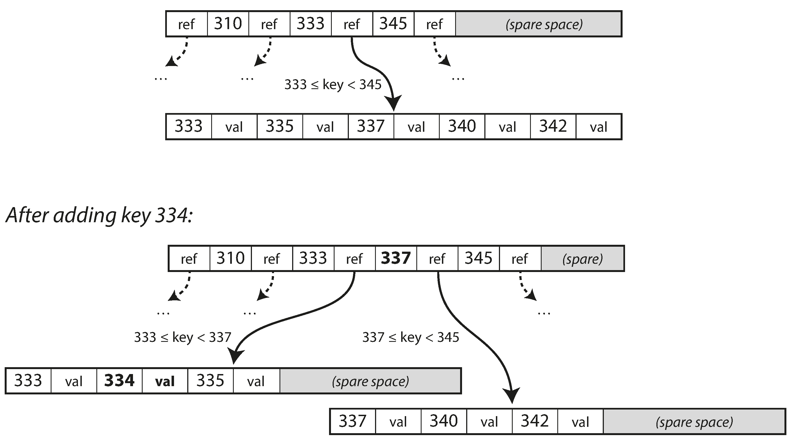

link:: 
tags:: 
relations:: [Designing Data-Intensive Applications](Designing%20Data-Intensive%20Applications.md) | [DS_B Trees](../../Data_Structure_And_Algo/DS_B%20Trees.md)

[<- BACK TO BOOK ](Designing%20Data-Intensive%20Applications.md)
[<- Back to Chapter 3](DDIA-%20Chapter%203.%20Storage%20and%20Retrieval.md)

# Chapter 3.4 B-Trees

 _B-tree_ is most used indexing structure.

 They remain the standard index implementation in almost all relational databases, and many nonrelational databases use them too.

Like SSTables, B-trees keep key-value pairs sorted by key, which allows efficient key-value lookups and range queries. 
But that’s where the similarity ends: B-trees have a very different design philosophy.

- B-trees break the database down into fixed-size _blocks_ or _pages_, traditionally 4 KB in size (sometimes bigger), and read or write one page at a time. This design corresponds more closely to the underlying hardware, as disks are also arranged in fixed-size blocks.
- Each page can be identified using an address or location, which allows one page to refer to another—similar to a pointer, but on disk instead of in memory. We can use these page references to construct a tree of pages.
- One page is designated as the _root_ of the B-tree.The page contains several keys and references to child pages. 
- Each child is responsible for a continuous range of keys, and the keys between the references indicate where the boundaries between those ranges lie.

- The number of references to child pages in one page of the B-tree is called the _branching factor_.
- Notice leaf page will contain values of the keys.
- **Value update :** Change the value in that page, and write the page back to disk (any references to that page remain valid)
- **New Key:**  find the page whose range encompasses the new key and add it to that page. If there isn’t enough free space in the page to accommodate the new key, it is split into two half-full pages, and the parent page is updated to account for the new subdivision of key ranges.

- Most databases can fit into a B-tree that is **three or four levels deep**, so you don’t need to follow many page references to find the page you are looking for. **(A four-level tree of 4 KB pages with a branching factor of 500 can store up to 250 TB.)**

### Making B-trees reliable

**Write operation in B-Trees is InPlace**-
The basic underlying write operation of a B-tree is to overwrite a page on disk with new data. It is assumed that the overwrite does not change the location of the page; i.e., all references to that page remain intact when the page is overwritten.
You can think of overwriting a page on disk as an actual hardware operation.

Moreover, some operations require several different pages to be overwritten. 
For example, if you split a page because an insertion caused it to be overfull, you need to write the two pages that were split, and also overwrite their parent page to update the references to the two child pages. 
This is a dangerous operation, because if the database crashes after only some of the pages have been written, you end up with a corrupted index.

In order to make the database **resilient to crashes**, it is common for B-tree implementations to include an additional data structure on disk: 
**a _write-ahead log_ (WAL, also known as a _redo log_)**
This is an append-only file to which every B-tree modification must be written before it can be applied to the pages of the tree itself.

An additional complication of updating pages in place is that careful **concurrency control** is required if multiple threads are going to access the B-tree at the same time—otherwise a thread may see the tree in an inconsistent state. 
This is typically done by protecting the tree’s data structures with **_latches_ (lightweight locks)**.

### B-tree optimizations

-  Instead of overwriting pages and maintaining a WAL for crash recovery, some databases (like LMDB) use a **copy-on-write scheme** . A modified page is written to a different location, and a new version of the parent pages in the tree is created, pointing at the new location. This approach is also useful for concurrency control.
    
-  **Save space** in pages by not storing the entire key, but abbreviating it. Especially in pages on the interior of the tree, keys only need to provide enough information to act as boundaries between key ranges.
    
-  Many B-tree implementations therefore try to lay out the tree so that **leaf pages appear in sequential order** on disk. However, it’s difficult to maintain that order as the tree grows.
    
-   Additional pointers have been added to the tree. For example, each leaf page may have **references to its sibling pages to the left and right**, which allows scanning keys in order without jumping back to parent pages.
    
-   B-tree variants such as **_fractal trees_** borrow some log-structured ideas to reduce disk seeks (and they have nothing to do with fractals).

