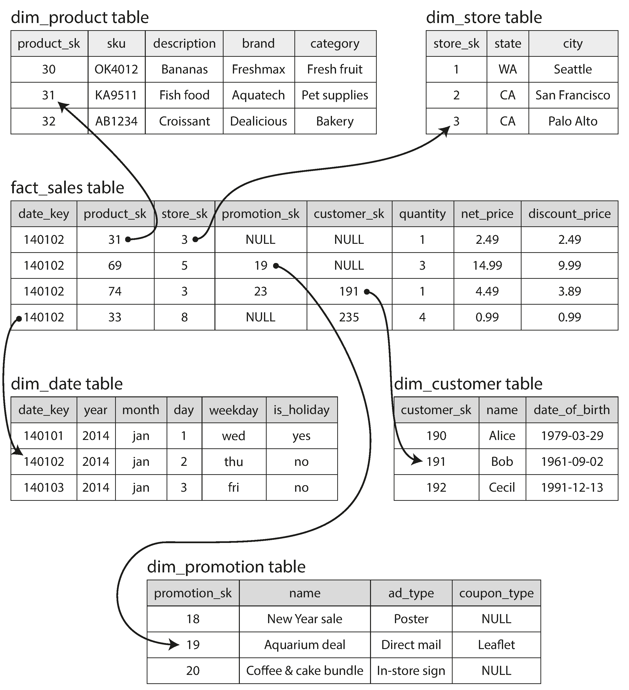

link:: 
tags:: 
relations:: [Designing Data-Intensive Applications](Designing%20Data-Intensive%20Applications.md) 

[<- BACK TO BOOK ](Designing%20Data-Intensive%20Applications.md)
[<- Back to Chapter 3](DDIA-%20Chapter%203.%20Storage%20and%20Retrieval.md)

# Chapter 3.7 Transaction Processing or Analytics?

- In the early days of business data processing, a write to the database typically corresponded to a _commercial transaction_ taking place: making a sale, placing an order with a supplier, paying an employee’s salary, etc
-  _transaction_ : referring to a group of reads and writes that form a logical unit.

> A transaction needn’t necessarily have ACID (atomicity, consistency, isolation, and durability) properties. _Transaction processing_ just means allowing clients to make low-latency reads and writes.

#### Access Patterns
- An application typically looks up a small number of records by some key, using an index. Records are inserted or updated based on the user’s input. Because these applications are interactive, the access pattern became known as _**online transaction processing_ (OLTP)**.
- databases also started being increasingly used for _data analytics_.
- **_online analytic processing_ (OLAP)** : Usually an analytic query needs to scan over a huge number of records, only reading a few columns per record, and calculates aggregate statistics (such as count, sum, or average) rather than returning the raw data to the user.

Comparing characteristics of transaction processing versus analytic systems

| Property             | Transaction processing systems (OLTP)             | Analytic systems (OLAP)                   |
| -------------------- | ------------------------------------------------- | ----------------------------------------- |
| Main read pattern    | Small number of records per query, fetched by key | Aggregate over large number of records    |
| Main write pattern   | Random-access, low-latency writes from user input | Bulk import (ETL) or event stream         |
| Primarily used by    | End user/customer, via web application            | Internal analyst, for decision support    |
| What data represents | Latest state of data (current point in time)      | History of events that happened over time |
| Dataset size         | Gigabytes to terabytes                            | Terabytes to petabytes                    |

In the late 1980s and early 1990s, there was a trend for companies to stop using their OLTP systems for analytics purposes, and to run the analytics on a separate database instead. This separate database was called a **_data warehouse_**.

## Data Warehousing

- An enterprise may have dozens of different transaction processing systems: systems powering the customer-facing website, controlling point of sale (checkout) systems in physical stores, tracking inventory in warehouses, planning routes for vehicles, managing suppliers, administering employees, etc. 
- Each of these systems is complex and needs a team of people to maintain it, so the systems end up operating mostly autonomously from each other.

- A _data warehouse_, by contrast, is a separate database that analysts can query to their hearts’ content, without affecting OLTP operations.
- The data warehouse contains a read-only copy of the data in all the various OLTP systems in the company. 
- Data is extracted from OLTP databases (using either a periodic data dump or a continuous stream of updates), transformed into an analysis-friendly schema, cleaned up, and then loaded into the data warehouse.
- This process of getting data into the warehouse is known as **_Extract–Transform–Load_ (ETL)**.

### The divergence between OLTP databases and data warehouses

 - There are many graphical data analysis tools that generate SQL queries, visualize the results, and allow analysts to explore the data (through operations such as drill-down and slicing and dicing).
 - Even if these look similar , the internals of these systems can look quite different, because they are optimized for very different query patterns.
 - Many database vendors now focus on supporting either transaction processing or analytics workloads, but not both

 - Data warehouse vendors such as **Teradata, Vertica, SAP HANA, and ParAccel** typically sell their systems under expensive commercial licenses. Amazon RedShift is a hosted version of ParAccel.
 - Recently, a plethora of open source SQL-on-Hadoop projects have emerged. These include **Apache Hive, Spark SQL, Cloudera Impala, Facebook Presto, Apache Tajo, and Apache Drill** . Some of them are based on ideas from **Google’s Dremel** .

## Stars and Snowflakes: Schemas for Analytics

- Many data warehouses are used in a fairly formulaic style, known as a **star schema** (also known as **dimensional modeling**)
- At the center of the schema is a so-called **fact table**.
- Each row of the fact table represents an event that occurred at a particular time
- Other columns in the fact table are foreign key references to other tables, called **_dimension tables_**.
- As each row in the fact table represents an event, the dimensions represent the _who_, _what_, _where_, _when_, _how_, and _why_ of the event.
- The name “star schema” comes from the fact that when the table relationships are visualized, the fact table is in the middle, surrounded by its dimension tables; the connections to these tables are like the rays of a star.
- A variation of this template is known as the **snowflake schema**, where dimensions are further broken down into subdimensions.
- Snowflake schemas are more normalized than star schemas, but star schemas are often preferred because they are simpler for analysts to work with
- In a typical data warehouse, tables are often very wide: fact tables often have over 100 columns, sometimes several hundred.

## Column-Oriented Storage
- Although fact tables are often over 100 columns wide, a typical data warehouse query only accesses 4 or 5 of them at one time.
- In most OLTP databases, storage is laid out in a row-oriented fashion: all the values from one row of a table are stored next to each other.
- The idea behind column-oriented storage is simple: don’t store all the values from one row together, but store all the values from each column together instead.
- The column-oriented storage layout relies on each column file containing the rows in the same order.

## Column Compression
- column-oriented storage often lends itself very well to compression.
- One technique that is particularly effective in data warehouses is bitmap encoding.

> COLUMN-ORIENTED STORAGE AND COLUMN FAMILIES
> Cassandra and HBase have a concept of column families, which they inherited from Bigtable [9]. However, it is very misleading to call them column-oriented: within each column family, they store all columns from a row together, along with a row key, and they do not use column compression. Thus, the Bigtable model is still mostly row-oriented.

### Memory bandwidth and vectorized processing

Bottlenecks : 
1. bandwidth for getting data from disk into memory.
2. efficiently using the bandwidth from main memory into the CPU cache
3. making use of single-instruction-multi-data (SIMD) instructions in modern CPUs

- Besides reducing the volume of data that needs to be loaded from disk, column-oriented storage layouts are also good for making efficient use of CPU cycles.

## Sort Order in Column Storage
- In a column store, it doesn’t necessarily matter in which order the rows are stored. It’s easiest to store them in the order in which they were inserted, since then inserting a new row just means appending to each of the column files.
- Note that it wouldn’t make sense to sort each column independently, because then we would no longer know which items in the columns belong to the same row
- The administrator of the database can choose the columns by which the table should be sorted, using their knowledge of common queries.
- Another advantage of sorted order is that it can help with compression of columns.

### Several different sort orders
- Different queries benefit from different sort orders, so why not store the same data sorted in _several different_ ways?
- You might as well store that redundant data sorted in different ways so that when you’re processing a query, you can use the version that best fits the query pattern.

## Writing to Column-Oriented Storage

 - most of the load consists of large read-only queries run by analysts. Column-oriented storage, compression, and sorting all help to make those read queries faster. However, they have the downside of making writes more difficult.
 - All writes first go to an in-memory store, where they are added to a sorted structure and prepared for writing to disk.
 
## Aggregation: Data Cubes and Materialized Views
- Another aspect of data warehouses that is worth mentioning briefly is **materialized aggregates**.
- One way of creating a cache for such queries is a _materialized view_.
- A common special case of a materialized view is known as a **data cube or OLAP cube.**
- The advantage of a materialized data cube is that certain queries become very fast because they have effectively been precomputed.

