link::  https://www.usenix.org/conference/atc13/technical-sessions/presentation/bronson | [youtube presentation]( https://www.youtube.com/watch?v=sNIvHttFjdI)
tags:: 
relations:: 

[PAPER - TAO- Facebook’s Distributed Data Store for the Social Graph](TAO-%20Facebook’s%20Distributed%20Data%20Store%20for%20the%20Social%20Graph.pdf)
[Another study link to paper](https://www.youtube.com/watch?v=qV9Hz5TVByo)

# TAO- Facebook’s Distributed Data Store for the Social Graph

TAO is a system that stores and provides access to the social graph.
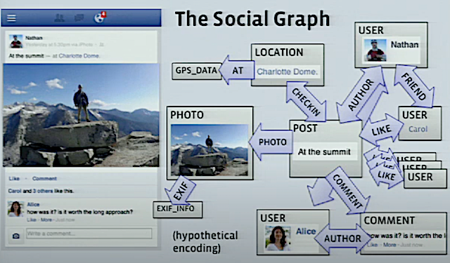
It not only stores info that you see but also internal info like exif info.

Rendering the site - webserver query the graph filter , aggregate and filter the content then render the view. And this is done for every request dynamically.
Why dynamically - 
- facebook is all about personalization 
- every user has different view/subset of graph.
- difficult to predict ahead the content
- timeliness - facebook is communication mechanism. even liking a post is a low friction message.

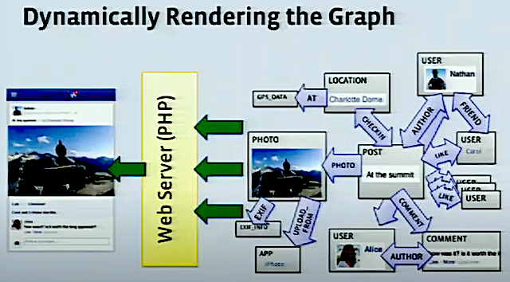

TAO: includes databases,cache machines,communication stack in web servers.
Because of dynamic nature of TAO, cache is used aggressively.caching individual nodes and edges.
and the query volume is very high - `1 billion queries/ second` and single deployed instance. 
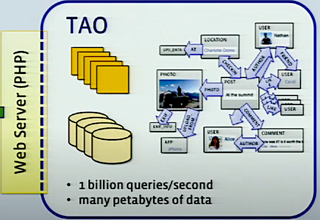

TAO has very simple API nothing fancy multi hop system like fetch this then fetch that.
So we have to do dynamic resolution of data dependencies.
For example web server rendering the post will do bunch of queries in parallel that navigate out from post. and still we will need more then one round.
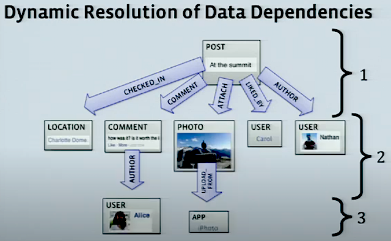

### older system before TAO

API's provided by TAO predates TAO. These are just bunch of PHP abstraction called "objects and association API" that wrapped the mysql db and cached nodes and edges in memcache(kind of look aside cache).
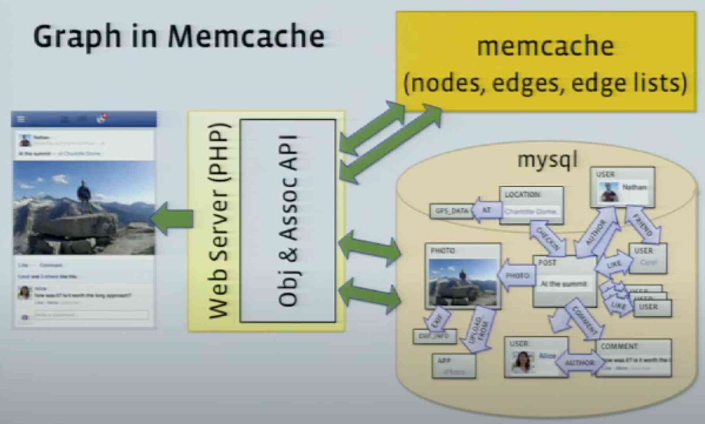

### API model

Objects = Nodes

Objects identified by global **unique 64-bit ID**. We dont need to know the type of the node.
Typed with  a schema for fields. i.e. once you lookup the object with ID you know the type and then we can fetch fields based on schema of type

Association = Edges

Identified by `<id1, type, id2>`
Bidirectional association are two edges with same or different types. we need to update any change to both edges.

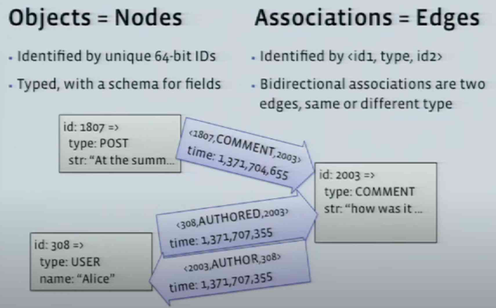

### Association List
Edges coming out of a node has a natural ordering. here it is almost always time.
Time is 32 bit int, it can contain anything but in most cases contain time.
Objects and Association List is the only thing we can query with `Objects and association API`.
We can also query size of association list and top recent in association list.

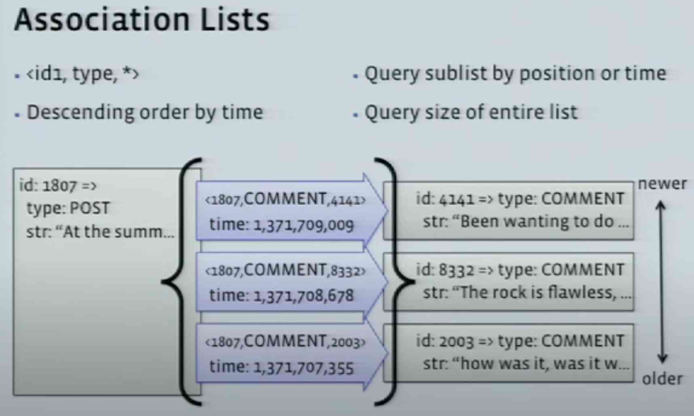

FB get 500 reads for every write. so Read latency is very important.
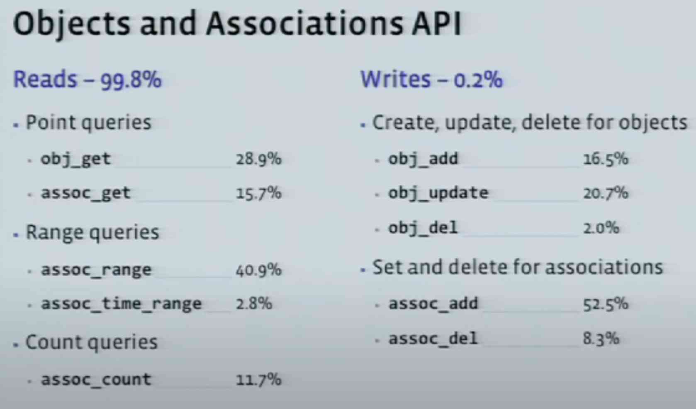

### Scaling
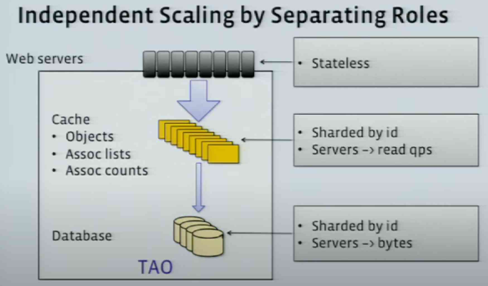

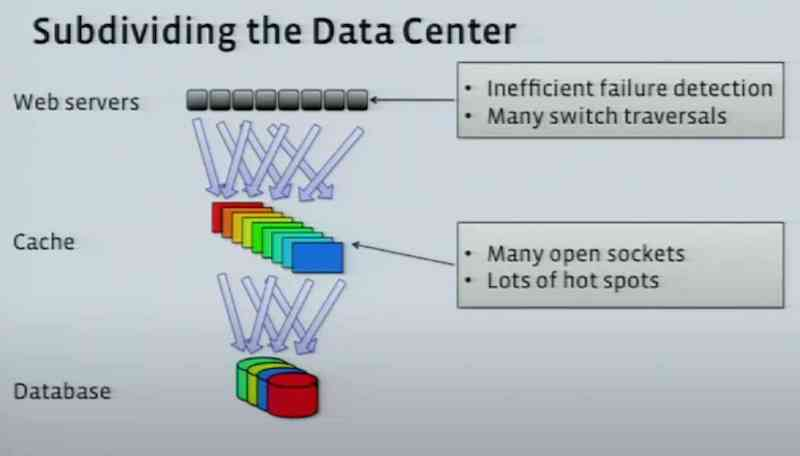

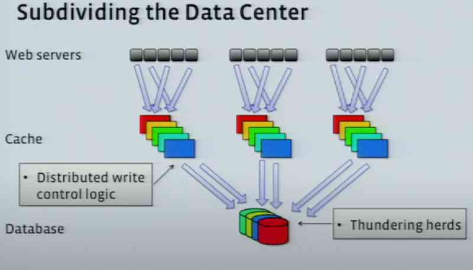
Note: User are made sticky to one data center, so that populated cache is used.

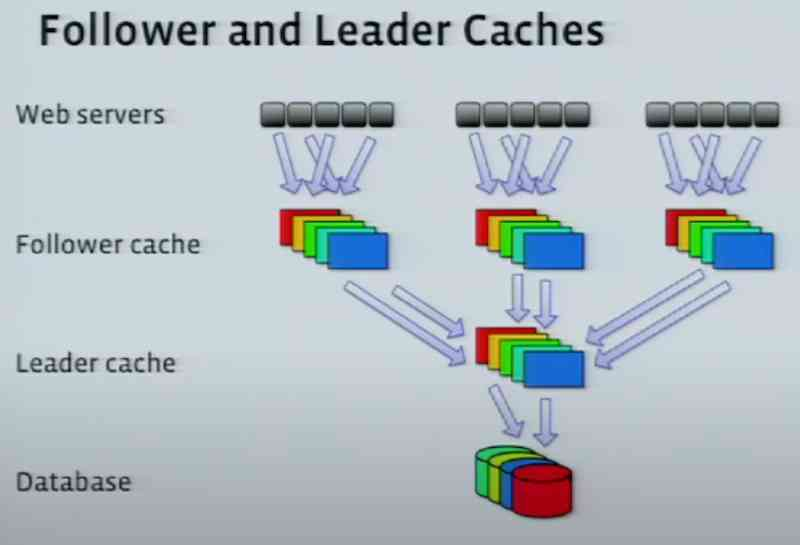

## Writes
Write through Cache (top to bottom)
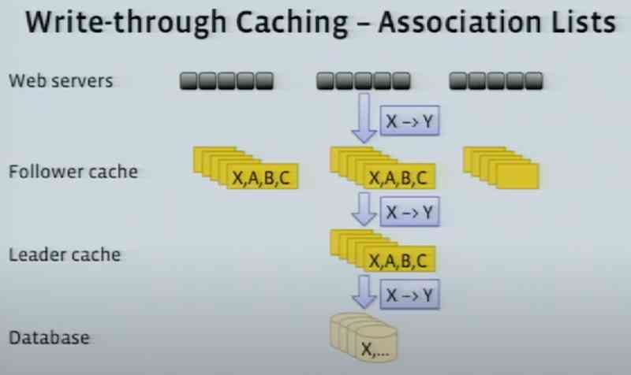
acknowledgment (bottom to top) 
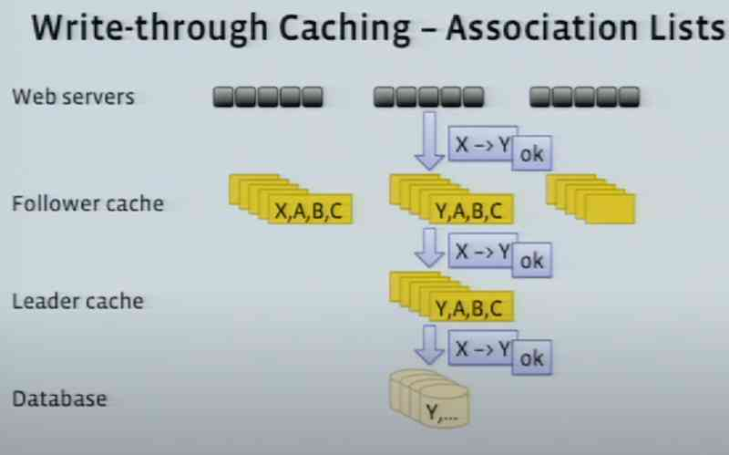

Updating other follower caches.
Cache Invalidation - Fixing the cost of Association list is lot lower then then just sending invalidation message and to reload it later.
So to preserve the value in cache , we need to send refill messages for association list. i.e. this part of association list is invalid please refill it.
Why just refill massage not actual value - 
1. space optimization.
2. it make all cache consistency messages idempotent. this give flexibility that in multi-data center model that messages are delivered only once or in order.
3. In case of failure , we can just replay cache inconsistency messages.

## DB replication
Writes from anywhere (master or replica data centers) are sent to leader cache of master data center.
Cache invalidation messages on replica are delayed till it is synced with updated writes.

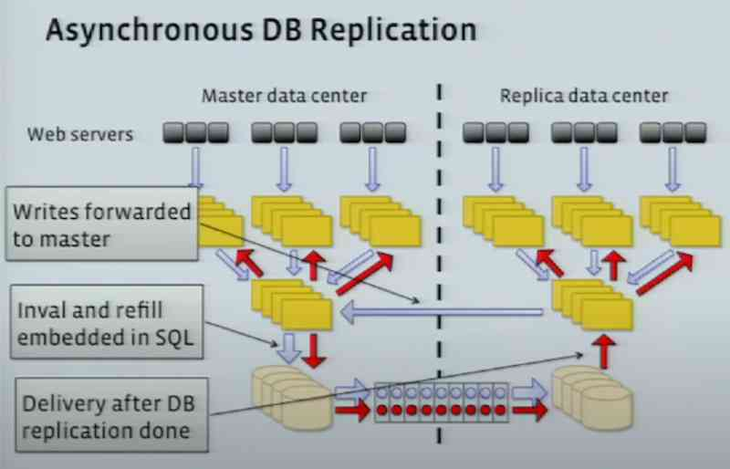

## read failover strategy  

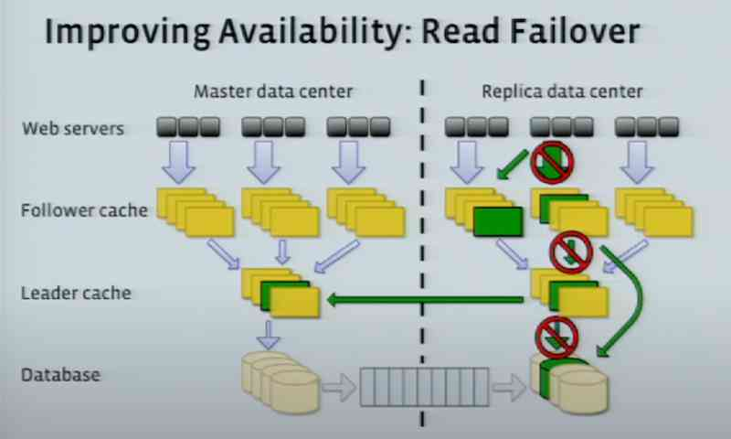

### TAO's goal/challenges
- Efficiency at scale
- Low read latency
- Timeliness of writes
- High Read availability - (because of high query load)

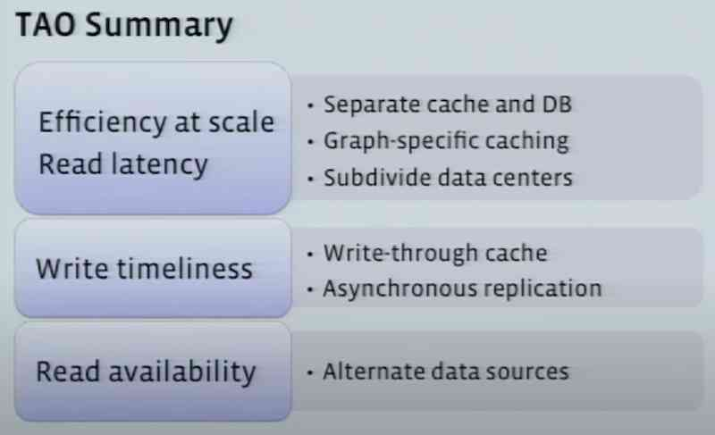

## other point
- because of good separation between layers FB can easily replace MYSQL with other efficient data stores.
- Right now MySql serves the purpose as they are familiar with and it is predictable and and supports replication.
- maximum size of node is 1 mb. Image are stored in other db, node just contains link to image.
- Follower caches has very good cache hit rate.
- Follower cache has cache eviction time of around one day and leader has around half hour.
- Leader cache does not help with read latency but reduce temperature of the hot spot.
- TAO is not designed for write heavy workload.
- Master DB in TAO is always consistent (not eventual consistent).
- Also have other systems that do indexing on much smaller subgraphs like birthday dates etc instead of doing them with TAO.

## Next
- [Scale at Facebook](https://www.infoq.com/presentations/Scale-at-Facebook/)
- [Large-Scale Low-Latency Storage for the Social Network - Data@Scale](https://www.youtube.com/watch?v=5RfFhMwRAic)
- [Panel Facebook's Distributed Database Evolution](https://www.youtube.com/watch?v=pDjrmc_rwJI)
- [ F8 2015 - Lifting the Curtain: the Data Infrastructure Behind Facebook Apps](https://www.youtube.com/watch?v=T9YbeJ4DMuM)