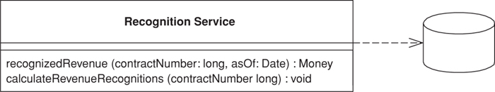

# Transaction Script
- Organizes business logic by procedures where each procedure handles a single request from the presentation.

- Bussiness applications are mostly series of transactions.

-**A Transaction Script organizes all the Bussiness Logic as a single procedure, making calls directly to the database or through a thin database wrapper**

## How it works
- With Transaction Script the domain logic is primarily organized by the transactions that you carry out with the system.
  - If your need is to book a hotel room, 
  - the logic to check room availability,
  -  calculate rates, and 
  -  update the database 
  -  is found inside the Book Hotel Room procedure.
- Of course, as with any other program you should structure the code into modules
- benefits of this approach is that you don’t need to worry about what other transactions are doing.
- Your task is to get the input, interrogate the database, munge, and save your results to the database.

- Where you put the Transaction Script will depend on how you organize your layers.
- May be in Server Page, a CGI Script, or a database session object.
- **My preference is to separate Transaction Scripts as much as you can.**
-  Put them in distinct subroutines
-  Put them in classes separate from those that handle presentation and data source.
-  In addition, don’t have any calls from the Transaction Scripts to any presentation logic; that will make it easier to modify the code and test the Transaction Scripts.

### Two ways of organizing Transaction Script Classes
- Have several Transaction Scripts in a single class.
- Here each class defines a subject area of related Transaction Scripts.
- Another way is to have Each Transaction Script with each Class.
- 
